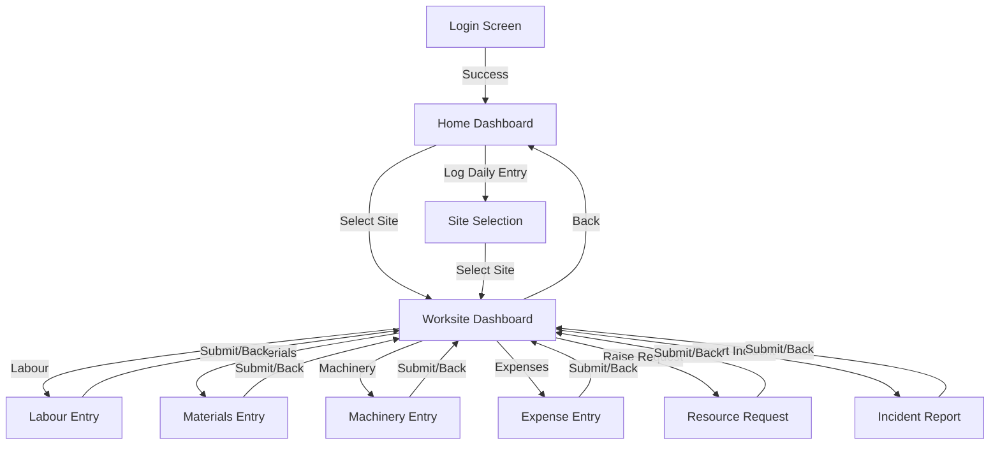
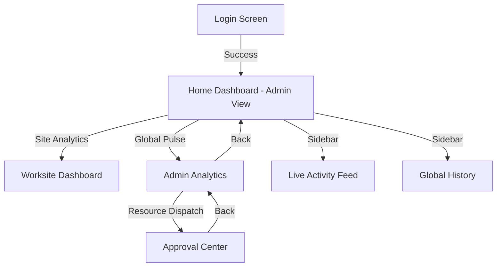

# SiteOps UI Architecture & Design Documentation

This document provides a comprehensive overview of the SiteOps application architecture, routing, views, data models, and UI connections.

## 1. High-Level Architecture
SiteOps is a modern, responsive Single Page Application (SPA) built using **React**, **TypeScript**, and **Vite**.

- **Styling**: Vanilla CSS with a focus on modern aesthetics (Glassmorphism, vibrant gradients, and smooth transitions).
- **Navigation**: Managed via a custom state-driven stack in `App.tsx` (using `navState` and `stack`), which allows for granular control over the navigation history and back-button behavior.
- **Animations**: Powered by **Framer Motion** (`motion/react`) for smooth view transitions and interactive feedback.
- **State Management**: Primarily handled through React `useState` and `useCallback` in the root `App.tsx` component, which acts as a central hub for data and navigation.

---

## 2. User Roles
The application supports two primary roles, which determine the availability of certain features and views:

1.  **Supervisor**: Focused on daily site operations, entering data for labour, materials, and machinery, and viewing site-specific dashboards.
2.  **Admin**: Has access to high-level analytics, approval centers for requests, and a live feed of all activities across all sites.

---

## 3. Routing & Views
The app uses a state-based routing system defined in `App.tsx`. Each "View" is a component rendered conditionally based on the `currentView` state.

### Core Views
| View ID | Description |
| :--- | :--- |
| `LOGIN` | Entry point for authentication. |
| `HOME` | The primary dashboard showing an overview of sites (for Supervisors) or global stats (for Admins). |
| `WORKSITE_DASHBOARD` | Detailed view for a specific selected site, showing recent entries and stats. |
| `SITE_SELECTION` | A dedicated view to search and select a construction site. |
| `SITE_DETAIL` | Deep-dive into site-specific data and configuration. |

### Operational Entry Views
These views are optimized for quick data entry on the field:
| View ID | Description |
| :--- | :--- |
| `LABOUR_ENTRY` | Specialized form for logging daily labour (Work type, worker count, etc.). |
| `MATERIALS_ENTRY` | Specialized form for logging material receipts (Material type, quantity, etc.). |
| `MACHINERY_ENTRY` | Specialized form for logging machinery usage (Equipment, hours active, etc.). |
| `EXPENSE_ENTRY` | Quick entry for site-specific expenses. |
| `EXPENSE_MANAGER` | High-level view to manage and audit expenses across sites. |
| `INCIDENT_REPORT` | Form to log safety violations or site blockages. |
| `RESOURCE_REQUEST` | View to request additional Labour, Materials, or Funds. |

### Legacy/Generic Flow
A dynamic form generation system based on a "Master Dictionary":
| View ID | Description |
| :--- | :--- |
| `ENTRY_CATEGORIES` | Selection of top-level categories (e.g., Labour, Materials, Financials). |
| `ENTRY_SUBCATEGORIES` | Selection of specific sub-categories based on the parent. |
| `ENTRY_FORM` | Dynamically generated form based on the selected sub-category fields. |

### Management & Admin Views
| View ID | Description |
| :--- | :--- |
| `ADMIN_ANALYTICS` | Global charts and performance metrics across all projects. |
| `ADMIN_APPROVALS` | Queue for approving resource requests or pending field additions. |
| `ADMIN_LIVE_FEED` | A real-time stream of all entries being submitted across the organization. |
| `HISTORY` | Audit log of all entries with filtering and editing capabilities. |
| `NOTIFICATIONS` | Feed of alerts, approvals, and system messages. |
| `PROFILE` | User profile management and settings. |
| `SETTINGS` | App configuration and role-switching (for development/demo). |

---

## 4. Data Models & Fields

### **Site**
Represents a construction project.
- `id`: Unique identifier (e.g., 'oak-tower').
- `name`: Human-readable name.
- `location`: Physical location.
- `status`: 'In Progress', 'Blocked', or 'Completed'.
- `progress`: Percentage completion (0-100).
- `spend`: Total expenditure to date.
- `budget`: Allocated budget.
- `headcount`: Number of active workers.
- `phase`: Current construction phase.
- `alerts`: Number of active issues.

### **Labour Entry**
- `siteId`: Reference to the Site.
- `date`: Entry date.
- `workType`: Category of work (e.g., 'Steelwork', 'Concretework').
- `peopleCount`: Number of workers involved.
- `remarks`: Additional notes.

### **Material Entry**
- `siteId`: Reference to the Site.
- `date`: Receipt/Consumption date.
- `material`: Type (e.g., 'Cement', 'M-Sand').
- `quantity`: Amount received/used.
- `unit`: Unit of measurement (e.g., 'Bags', 'Tons').

### **Machinery Entry**
- `equipment`: Type of machinery (e.g., 'Excavator', 'Tower Crane').
- `count`: Number of units active.
- `hoursActive`: Total hours of operation.

### **Expense Entry**
- `description`: What the money was spent on.
- `amount`: Monetary value.
- `category`: 'Labour', 'Materials', 'Equipment', or 'Misc'.

### **Resource Request**
- `type`: 'Labour', 'Materials', 'Money', or 'Machinery'.
- `details`: Description of what is needed.
- `status`: 'Pending', 'Approved', or 'Declined'.

---

## 5. UI Flow & Connections

### **Navigation Lifecycle**
1.  **Authentication**: User starts at `LOGIN`. On success, they land on `HOME`.
2.  **Site Focus**: From `HOME`, the user typically selects a site, which navigates them to the `WORKSITE_DASHBOARD`.
3.  **Data Entry**: From the `WORKSITE_DASHBOARD`, users can launch specialized entry views (`LABOUR_ENTRY`, etc.) or the generic `ENTRY_CATEGORIES` flow.
4.  **Submission**: Submitting a form typically adds data to the global state and returns the user to the dashboard or home.
5.  **Audit**: Users can navigate to `HISTORY` to see past entries, filter by site/category, and edit or delete them.

### **Connection Points**
- **Footer Navigation**: A persistent `GlobalFooter` allows quick access to `HOME`, `HISTORY`, `NOTIFICATIONS`, and `PROFILE`.
- **Admin Bridge**: Admins can jump from `ADMIN_ANALYTICS` to specific `ADMIN_APPROVALS` or check the `ADMIN_LIVE_FEED` for immediate site updates.
- **Role Awareness**: The UI dynamically hides/shows elements based on the current `role`. For example, a Supervisor cannot see the "Approval Center" by default.

---

## 6. UI Flow Diagrams

### **Supervisor: Operational Lifecycle**
The typical daily journey for a site supervisor, from site selection to data entry.



### **Admin: Management Oversight**
The journey for an administrator to monitor global health and handle approvals.



### **Global Navigation (Sidebar & Footer)**
How users move between utility views from any primary screen.

```mermaid
graph LR
    SUBGRAPH Primary_Views [Primary Dashboard Views]
        HOME[Home]
        DASH[Dashboard]
    END

    SUBGRAPH Utility_Views [Utility Views]
        HISTORY[History]
        NOTIF[Notifications]
        PROF[Profile]
        SET[Settings]
    END

    Primary_Views ---|Footer| Utility_Views
    Primary_Views ---|Sidebar| Utility_Views
    Utility_Views ---|Back| HOME
    PROF ---|Logout| LOGIN[Login Screen]
```

## 7. Data Architecture (Proposed Schema)

### **7.1 Identity & Access Management**
These tables handle user authentication and role-based permissions.

- **`users`**: Core user data.
    - *Fields*: `id`, `name`, `email`, `password_hash`, `role` (Admin/Supervisor), `avatar_url`, `created_at`.
- **`user_profiles`**: Extended metadata for users.
    - *Fields*: `phone`, `assigned_region`, `designation`.

### **7.2 Project Infrastructure**
These tables define the physical locations where work happens.

- **`sites`**: The physical construction sites.
    - *Fields*: `id`, `name`, `location`, `status` (In Progress, Blocked, Completed), `budget`, `total_spend`, `total_headcount`, `current_progress`, `current_phase`, `supervisor_id` (FK to users).

### **7.3 The "Big Four" Operational Logs**
These are the daily entries made by supervisors to track resources.

- **`labour_entries`**: Daily tracking of manpower.
    - *Fields*: `id`, `site_id`, `date`, `work_type` (Steelwork, Plumbing, etc.), `people_count`, `remarks`.
- **`material_entries`**: Tracking material arrivals and consumption.
    - *Fields*: `id`, `site_id`, `date`, `material_type`, `quantity`, `unit`, `remarks`.
- **`machinery_entries`**: Usage logs for heavy equipment.
    - *Fields*: `id`, `site_id`, `date`, `machinery_type`, `count`, `hours_active`, `remarks`.
- **`expense_entries`**: Tracking petty cash and vendor payments.
    - *Fields*: `id`, `site_id`, `date`, `description`, `amount`, `category` (Labour, Material, etc.), `entered_by_id` (FK to users).

### **7.4 Dynamic Form System (Master Dictionary)**
The app uses a dynamic schema to allow Admins to add new input fields without code changes.

- **`categories`**: Top-level entry types (e.g., "Labour", "Financials").
    - *Fields*: `id`, `name`, `icon`.
- **`subcategories`**: Groups of fields (e.g., "General Labour" under "Labour").
    - *Fields*: `id`, `category_id`, `name`.
- **`field_definitions`**: The actual inputs (e.g., "Worker Count", "Vendor Name").
    - *Fields*: `id`, `subcategory_id`, `label`, `field_type` (Number, Text, Dropdown), `unit`, `options` (for dropdowns).
- **`generic_entries`**: Stores data for entries that don't fit the "Big Four" standard schema.
    - *Fields*: `id`, `site_id`, `field_definition_id`, `value`, `timestamp`.

### **7.5 Governance & Logistics**
- **`resource_requests`**: Acquisition signals sent from Supervisors to Admins.
    - *Fields*: `id`, `site_id`, `request_type` (Labour, Money, etc.), `details`, `reason`, `status` (Pending, Approved, Declined), `requested_by_id`, `timestamp`.
- **`field_requests`**: When a supervisor proposes a new data field to the Admin.
    - *Fields*: `id`, `proposed_name`, `category_id`, `subcategory_id`, `status`, `requested_by_id`.

### **7.6 Safety & Communication**
- **`incident_reports`**: Tracking site blockages or safety violations.
    - *Fields*: `id`, `site_id`, `incident_type` (Safety/Block), `severity`, `description`, `duration_estimate`, `reported_by_id`, `timestamp`.
- **`notifications`**: System-wide alerts (Approvals, Budget Warnings).
    - *Fields*: `id`, `user_id`, `title`, `message`, `is_read`, `link_to_view`, `timestamp`.

### **7.7 Entity Relationships (Conceptual)**
- **User** `1:N` **Site** (as supervisor)
- **Site** `1:N` **Labour/Material/Machinery/Expense Entries**
- **Site** `1:N` **Resource Requests**
- **Category** `1:N` **Subcategory** `1:N` **Field Definition**
- **Admin** `1:N` **Notifications** (Broadcasting)

---

## 8. Technical Constants
- **Icons**: Lucide-React icons are mapped in `src/constants/icons.tsx`.
- **Master Dictionary**: Defined in `src/types.ts`, it governs the dynamic form generation for the generic entry flow.
- **Mock Data**: Pre-populated sites and entries are available in `src/types.ts` for immediate visualization.
