# SiteOps: Complete Database Schema & API Audit

This report provides a detailed, comprehensive architectural audit of all PostgreSQL database tables, schemas, relations, and REST API endpoints currently implemented in the SiteOps system.

---

## 🏗️ 1. Entity-Relationship Diagram (ERD)

The following Mermaid diagram maps all tables and their foreign key/relational dependencies within the PostgreSQL database:

```mermaid
erDiagram
    users {
        uuid id PK
        varchar email
        varchar name
        user_role role
        boolean email_verified
        timestamp created_at
        timestamp updated_at
    }

    sessions {
        uuid id PK
        uuid user_id FK
        text token
        timestamp expires_at
        text ip_address
        text user_agent
        timestamp created_at
        timestamp updated_at
    }

    accounts {
        uuid id PK
        uuid user_id FK
        varchar account_id
        varchar provider_id
        text access_token
        text refresh_token
        text id_token
        timestamp expires_at
    }

    user_profiles {
        uuid id PK
        uuid user_id FK "Unique"
        varchar phone
        varchar assigned_region
        varchar designation
        timestamp created_at
    }

    sites {
        uuid id PK
        varchar name "Unique"
        varchar location
        site_status status
        decimal budget
        integer current_progress
        varchar current_phase
        uuid supervisor_id FK
        timestamp archived_at
    }

    labour_entries {
        uuid id PK
        uuid site_id FK
        date date
        varchar work_type
        integer people_count
        text remarks
        uuid created_by FK
    }

    material_entries {
        uuid id PK
        uuid site_id FK
        date date
        varchar material_type
        decimal quantity
        varchar unit
        text remarks
        uuid created_by FK
    }

    machinery_entries {
        uuid id PK
        uuid site_id FK
        date date
        varchar equipment_type
        integer count
        decimal hours_active
        text remarks
        uuid created_by FK
    }

    expense_entries {
        uuid id PK
        uuid site_id FK
        date date
        varchar description
        decimal amount
        expense_category category
        uuid created_by FK
    }

    incident_reports {
        uuid id PK
        uuid site_id FK
        incident_type incident_type
        severity severity
        text description
        integer duration_estimate
        uuid reported_by FK
    }

    resource_requests {
        uuid id PK
        uuid site_id FK
        resource_type request_type
        text details
        text reason
        request_status status
        uuid requested_by FK
        uuid approved_by FK
    }

    field_requests {
        uuid id PK
        uuid site_id FK
        varchar proposed_name
        uuid category_id FK
        uuid subcategory_id FK
        field_type field_type
        request_status status
        uuid requested_by FK
    }

    notifications {
        uuid id PK
        uuid user_id FK
        notification_type type
        varchar title
        text message
        timestamp read_at
        varchar link_to_view
    }

    categories {
        uuid id PK
        varchar name "Unique"
        varchar icon
    }

    subcategories {
        uuid id PK
        uuid category_id FK
        varchar name
    }

    field_definitions {
        uuid id PK
        uuid subcategory_id FK
        varchar label
        field_type field_type
        varchar unit
        jsonb options
    }

    generic_entries {
        uuid id PK
        uuid site_id FK
        date date
        uuid field_definition_id FK
        jsonb value
        uuid created_by FK
    }

    users ||--o{ sessions : "has many"
    users ||--o{ accounts : "has many"
    users ||--|| user_profiles : "has one"
    users ||--o{ sites : "supervises"
    users ||--o{ labour_entries : "creates"
    users ||--o{ material_entries : "creates"
    users ||--o{ machinery_entries : "creates"
    users ||--o{ expense_entries : "creates"
    users ||--o{ incident_reports : "reports"
    users ||--o{ resource_requests : "requests"
    users ||--o{ field_requests : "requests"
    users ||--o{ notifications : "receives"
    users ||--o{ generic_entries : "creates"

    sites ||--o{ labour_entries : "logs"
    sites ||--o{ material_entries : "logs"
    sites ||--o{ machinery_entries : "logs"
    sites ||--o{ expense_entries : "logs"
    sites ||--o{ incident_reports : "logs"
    sites ||--o{ resource_requests : "logs"
    sites ||--o{ field_requests : "logs"
    sites ||--o{ generic_entries : "logs"

    categories ||--o{ subcategories : "groups"
    categories ||--o{ field_requests : "requests"
    subcategories ||--o{ field_definitions : "contains"
    subcategories ||--o{ field_requests : "requests"
    field_definitions ||--o{ generic_entries : "defines"
```

---

## 🗄️ 2. PostgreSQL Tables & Schemas

### 1. Schema Enums
*   `site_status`: `In Progress`, `Blocked`, `Completed`
*   `request_status`: `Pending`, `Approved`, `Declined`
*   `expense_category`: `Labour`, `Materials`, `Equipment`, `Misc`
*   `resource_type`: `Labour`, `Materials`, `Money`, `Machinery`
*   `incident_type`: `Safety`, `Block`
*   `severity`: `Low`, `Medium`, `High`, `Critical`
*   `notification_type`: `approval`, `budget_alert`, `incident`, `system`
*   `field_type`: `Number`, `Text`, `Dropdown`
*   `user_role`: `Admin`, `Supervisor`

---

### 2. User & Authentication Tables
These tables support the Better Auth system:

#### A. Users (`users` / `betterAuthUsers`)
Tracks authenticated user credentials and global permissions:
*   `id` (uuid, Primary Key, auto-generated)
*   `email` (varchar(255), Not Null)
*   `name` (varchar(255))
*   `role` (user_role, Default: `'Supervisor'`)
*   `emailVerified` (boolean, Default: `false`)
*   `createdAt`, `updatedAt` (timestamps)

#### B. Sessions (`sessions` / `betterAuthSessions`)
Tracks active user session tokens:
*   `id` (uuid, Primary Key)
*   `userId` (uuid, Foreign Key referencing `users.id`)
*   `token` (text, Unique)
*   `expiresAt` (timestamp)
*   `ipAddress`, `userAgent` (text)

#### C. User Profiles (`user_profiles`)
Extra structured information for site managers and admins:
*   `id` (uuid, Primary Key)
*   `userId` (uuid, Unique, foreign key referencing `users.id`)
*   `phone` (varchar(20))
*   `assignedRegion` (varchar(100))
*   `designation` (varchar(100))

---

### 3. Site & Log Tables

#### A. Sites (`sites`)
Stores individual construction worksites:
*   `id` (uuid, Primary Key)
*   `name` (varchar(255), Unique, Not Null)
*   `location` (varchar(255), Not Null)
*   `status` (site_status, Default: `'In Progress'`)
*   `budget` (decimal(15, 2), Not Null)
*   `currentProgress` (integer, Default: `0`)
*   `currentPhase` (varchar(100))
*   `supervisorId` (uuid, Not Null, foreign key referencing `users.id`)
*   `archivedAt` (timestamp, Nullable)

#### B. Labour Entries (`labour_entries`)
Daily logs of manual worksite personnel:
*   `id` (uuid, Primary Key)
*   `siteId` (uuid, Not Null, foreign key referencing `sites.id`)
*   `date` (date, Not Null)
*   `workType` (varchar(100), Not Null)
*   `peopleCount` (integer, Not Null)
*   `remarks` (text)
*   `createdBy` (uuid, Not Null, foreign key referencing `users.id`)

#### C. Material Entries (`material_entries`)
Daily logs of physical materials used or delivered:
*   `id` (uuid, Primary Key)
*   `siteId` (uuid, foreign key referencing `sites.id`)
*   `date` (date)
*   `materialType` (varchar(100))
*   `quantity` (decimal(12, 2))
*   `unit` (varchar(50))
*   `remarks` (text)
*   `createdBy` (uuid, foreign key referencing `users.id`)

#### D. Machinery Entries (`machinery_entries`)
Daily logs of machinery and active machinery hours:
*   `id` (uuid, Primary Key)
*   `siteId` (uuid, foreign key referencing `sites.id`)
*   `date` (date)
*   `equipmentType` (varchar(100))
*   `count` (integer)
*   `hoursActive` (decimal(8, 2))
*   `remarks` (text)
*   `createdBy` (uuid, foreign key referencing `users.id`)

#### E. Expense Entries (`expense_entries`)
Cash/expenditure outlays for petty items on site:
*   `id` (uuid, Primary Key)
*   `siteId` (uuid, foreign key referencing `sites.id`)
*   `date` (date)
*   `description` (varchar(500))
*   `amount` (decimal(12, 2))
*   `category` (expense_category)
*   `createdBy` (uuid, foreign key referencing `users.id`)

#### F. Incident Reports (`incident_reports`)
Safety incidents or structural block delays:
*   `id` (uuid, Primary Key)
*   `siteId` (uuid, foreign key referencing `sites.id`)
*   `incidentType` (incident_type)
*   `severity` (severity, Default: `'Low'`)
*   `description` (text)
*   `durationEstimate` (integer)
*   `reportedBy` (uuid, foreign key referencing `users.id`)

---

### 4. Custom Forms & Flexible Schemas
To support dynamic custom logging templates without making schema changes, the database uses a sub-category attribute map:

#### A. Categories (`categories`)
Main custom group blocks (e.g. "Concrete", "Roofing", "Excavations"):
*   `id` (uuid, Primary Key)
*   `name` (varchar(100), Unique, Not Null)
*   `icon` (varchar(50))

#### B. Subcategories (`subcategories`)
Second-tier dynamic fields (e.g. "Concrete Pouring", "Curing Details"):
*   `id` (uuid, Primary Key)
*   `categoryId` (uuid, foreign key referencing `categories.id`)
*   `name` (varchar(100))

#### C. Field Definitions (`field_definitions`)
Definitions for individual properties dynamically created within subcategories:
*   `id` (uuid, Primary Key)
*   `subcategoryId` (uuid, foreign key referencing `subcategories.id`)
*   `label` (varchar(100))
*   `fieldType` (field_type: `Number`, `Text`, `Dropdown`)
*   `unit` (varchar(50), e.g., `"cubic-meters"`, `"hours"`)
*   `options` (jsonb array of choices for dropdowns)

#### D. Generic Entries (`generic_entries`)
Key-value stores carrying actual data inputted under field definitions:
*   `id` (uuid, Primary Key)
*   `siteId` (uuid, foreign key referencing `sites.id`)
*   `date` (date)
*   `fieldDefinitionId` (uuid, foreign key referencing `field_definitions.id`)
*   `value` (jsonb holding user answers)
*   `createdBy` (uuid, foreign key referencing `users.id`)

---

### 5. Requests & Messaging

#### A. Resource Requests (`resource_requests`)
Formal supervisor supply requests (Labour/Materials/Money/Machinery):
*   `id` (uuid, Primary Key)
*   `siteId` (uuid, foreign key referencing `sites.id`)
*   `requestType` (resource_type)
*   `details` (text)
*   `reason` (text)
*   `status` (request_status, Default: `'Pending'`)
*   `requestedBy` (uuid, foreign key referencing `users.id`)
*   `approvedBy` (uuid, foreign key referencing `users.id`)

#### B. Field Requests (`field_requests`)
Requests made by Supervisors to request adding a custom new column/category definition:
*   `id` (uuid, Primary Key)
*   `siteId` (uuid, foreign key referencing `sites.id`)
*   `proposedName` (varchar(100))
*   `categoryId` (uuid, foreign key referencing `categories.id`)
*   `subcategoryId` (uuid, foreign key referencing `subcategories.id`)
*   `fieldType` (field_type)
*   `status` (request_status, Default: `'Pending'`)
*   `requestedBy` (uuid, foreign key referencing `users.id`)

#### C. Notifications (`notifications`)
Direct in-app messages to broadcast actions:
*   `id` (uuid, Primary Key)
*   `userId` (uuid, foreign key referencing `users.id`)
*   `type` (notification_type)
*   `title` (varchar(255))
*   `message` (text)
*   `readAt` (timestamp, Nullable)
*   `linkToView` (varchar(255))

---

## 🔌 3. Complete Backend API Directory Map

Every API route uses strict Next.js App Router rules and executes role checking via `requireSiteAccess(request)`.

### 1. Site Endpoints

#### `GET /api/sites`
*   **Access:** Supervisor (assigned sites) or Admin (all sites).
*   **Output:** Returns list array of sites.

#### `POST /api/sites`
*   **Access:** Admin only (or Supervisor for their own assigned logs).
*   **Payload:** `{ name, location, status?, budget, currentProgress?, currentPhase?, supervisorId? }`

#### `GET /api/sites/[id]`
*   **Access:** Assigned Supervisor or Admin.
*   **Output:** Details of a single site.

#### `DELETE /api/sites/[id]`
*   **Access:** Admin.
*   **Action:** Performs logical archives on worksites.

---

### 2. Log Entries Endpoints

#### `GET /api/sites/[id]/entries?type=all|labour|material|machinery|expense|incident&from=yyyy-mm-dd&to=yyyy-mm-dd`
*   **Access:** Supervisor or Admin.
*   **Output:** Returns matching logged items under that site within specified timeframe.

#### `POST /api/entries/labour`
*   **Payload:** `{ siteId, date, workType, peopleCount, remarks? }`
*   **Database:** Inserts into `labour_entries`.

#### `POST /api/entries/materials`
*   **Payload:** `{ siteId, date, materialType, quantity, unit, remarks? }`
*   **Database:** Inserts into `material_entries`.

#### `POST /api/entries/machinery`
*   **Payload:** `{ siteId, date, equipmentType, count, hoursActive, remarks? }`
*   **Database:** Inserts into `machinery_entries`.

#### `POST /api/entries/expenses`
*   **Payload:** `{ siteId, date, description, amount, category }`
*   **Database:** Inserts into `expense_entries`.

#### `POST /api/entries/incidents`
*   **Payload:** `{ siteId, incidentType, severity, description, durationEstimate? }`
*   **Database:** Inserts into `incident_reports`.

---

### 3. Dynamic Form Creation & Entries

#### `GET /api/forms/categories`
*   **Access:** Authenticated.
*   **Output:** List of category nodes.

#### `POST /api/forms/categories`
*   **Access:** Admin / Supervisor.
*   **Payload:** `{ name, icon? }` (uses similarity checks to prevent duplicates).

#### `GET /api/forms/categories/[id]`
*   **Output:** Full category hierarchy with subcategories and field definitions.

#### `POST /api/forms/subcategories`
*   **Payload:** `{ categoryId, name }`

#### `POST /api/entries/dynamic`
*   **Payload:** `{ siteId, date, fieldDefinitionId, value }`
*   **Database:** Writes key-value details to `generic_entries`.

---

### 4. Admin Live Feeds & Analytics

#### `GET /api/admin/analytics?siteId=uuid`
*   **Access:** Admin.
*   **Output:** Aggregates totals of spent budgets, incident metrics, and phase milestones.

#### `GET /api/admin/live-feed`
*   **Output:** Returns recent 20 logged entries across all sites chronologically.

#### `GET /api/admin/live-feed-sse`
*   **Output:** Streams real-time creations using Server-Sent Events.

---

### 5. Requests & Notifications

#### `GET /api/requests/resource`
*   **Access:** Supervisors (own requests) or Admins (all requests).

#### `POST /api/requests/resource`
*   **Payload:** `{ siteId, type, details, reason }`
*   **Triggers:** Creates `approval` notifications for all Admins.

#### `PATCH /api/requests/resource/[id]`
*   **Access:** Admin only.
*   **Payload:** `{ status: "Approved" | "Declined" }`

#### `GET /api/notifications`
*   **Access:** Authenticated user.
*   **Output:** Unread or total broadcasts.

#### `PATCH /api/notifications`
*   **Payload:** `{ markAllRead: true }`

#### `PATCH /api/notifications/[id]`
*   **Action:** Marks single notification read.
